(im so done, im genuinly gonna punch a hole in a wall, i was almost done adding links, finishing editing, typo fixing, and my laptop js shut off, not out of power, js turned off, im so done, so ill js submit ts now, and then js fix this later.)

# June 24th: Wrangling a chip with way too many pins

Day one!! The idea is a little handheld password manager. Screen, six buttons, SD
card in the back, plugs into your computer over USB-C. You scroll to the login
you want, hit PLAY, and it **types the password for you** like a keyboard would.

That "like a keyboard" bit is the whole trick, and it's why I picked the
**ESP32-S3** — it has native USB. So the board doesn't *pretend* to be a
keyboard, your computer genuinely thinks a keyboard got plugged in. No drivers,
no app, nothing. It just works on any computer you walk up to.

Opened **KiCad** and dropped the ESP32-S3 symbol in and immediately regretted
everything. This chip has an *insane* number of pins. I spent like the first
twenty minutes just scrolling up and down the symbol going "ok but which of these
am i actually allowed to touch"

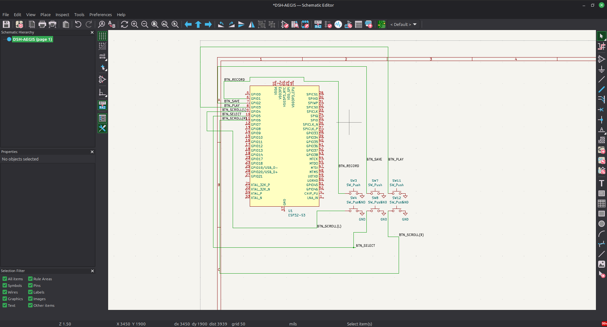

Once I calmed down it wasn't that bad. Started with the six buttons: RECORD,
SAVE, PLAY, SCROLL LEFT, SELECT, SCROLL RIGHT. Every button is stupidly simple —
one leg to a GPIO, other leg to ground. Thats it. No pull-up resistors needed
because the ESP32 has them built in and I can switch them on in code. Free parts,
love that.

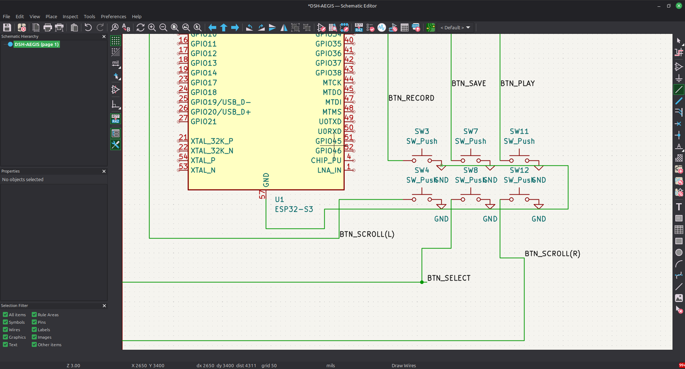

The green wires got a lil spaghetti by the end but KiCad only cares that things
are *connected*, not that they're pretty, so :shrug:

**Software used:** KiCad 8 (schematic editor)
**Lapse:** [LAPSE LINK HERE]

**Total time spent: 5h**

---

# June 25th: The schematic is done and I have seen 7,447 connectors

Finished the rest of the schematic today. Added:

* the **OLED** (128x32, I2C — only two wires, SCL and SDA, very well behaved)
* the **SD card** socket (SPI, four wires + power)
* the **USB-C** receptacle
* an **AMS1117-3.3** to knock 5V down to 3.3V
* two **5.1K resistors** on the CC pins

Those resistors are important and everyone forgets them. Without them the USB-C
port has no way to tell your laptop "hey im a device, give me 5V pls" and your
board just... does nothing. I only knew this because I read like four separate
forum threads of people going "why wont my usb c board turn on" and the answer
was ALWAYS the resistors. Learning from other ppls suffering. Efficient.

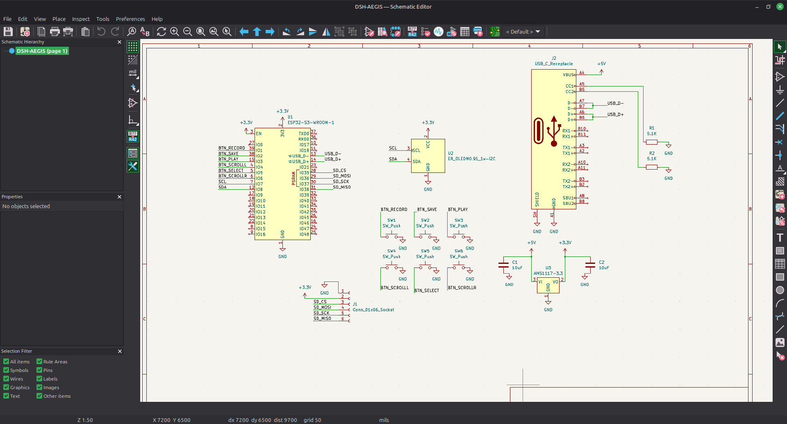

Then came footprints, which is the part of PCB design nobody warns you about. A
schematic symbol is basically a cartoon — it doesn't know how big the real
component actually is. So you gotta go through every single part and go "this
exact physical shape is what this thing is in real life."

15 components. One at a time. Out of a list of **7,447** footprints.

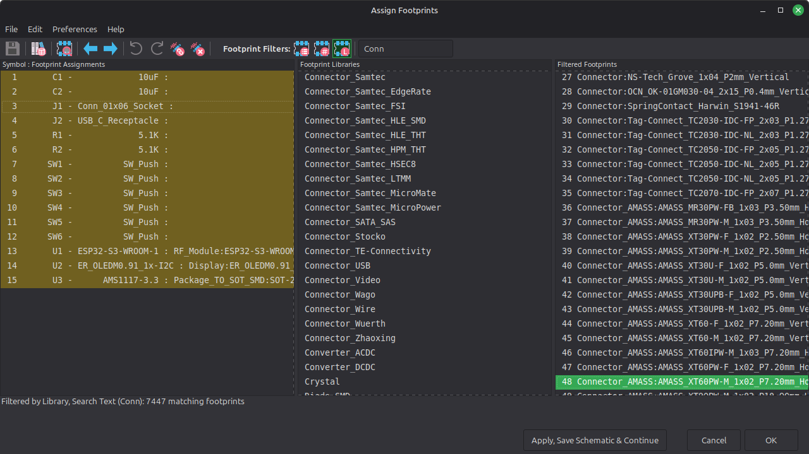

my eyes hurt. i have seen every connector ever manufactured by mankind

**Software used:** KiCad (schematic editor + footprint assignment)
**Lapse:** [LAPSE LINK HERE]

**Total time spent: 6h**

---

# June 26th: PCB routing (the day that ate my soul)

Biggest day by far. Today the schematic became an actual board.

When you first push everything into the PCB editor it just dumps all your parts
in a heap with a horrifying spiderweb of thin white lines showing what needs to
connect to what. It looks impossible. It is not impossible. It just takes eight
hours of your life.

Layout plan: six buttons in a 2x3 grid at the bottom like a keypad, OLED sitting
right above them, ESP32 up top, USB-C on the left edge so the cable comes out the
side instead of jabbing into your hand.

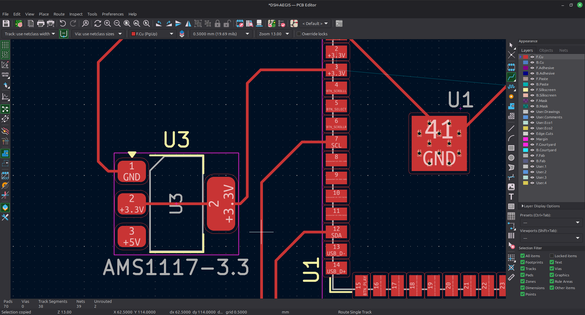

Fun fact I learned the annoying way: the ESP32 module has an **antenna** on it,
and you are NOT allowed to put copper underneath an antenna or the wifi just...
degrades. So there's a big pink hatched KEEP-OUT ZONE at the top of my board.
It's a tiny no-fly zone. Do not enter. Respect the zone.

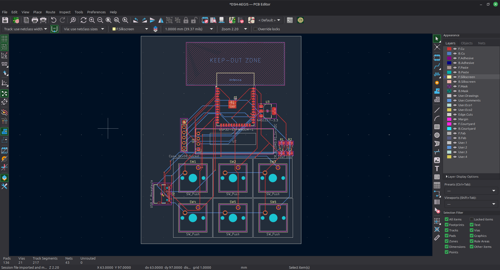

Final tally: **217 track segments, 21 vias, 43 nets, 0 unrouted.**

that last number is the one that matters and I looked at it for a suspiciously
long time feeling extremely smug

Also I did not move from this chair for eight hours. Auggie sat on the desk,
looked at the screen, looked at me, and left. Felt like a review.

**Software used:** KiCad (PCB editor)
**Lapse:** [LAPSE LINK HERE]

**Total time spent: 8h**

---

# June 27th: Silkscreen art >>> actual engineering

Chill day today. All the electrical stuff works so I just... decorated.

Silkscreen is the white printing on a PCB and here's the thing — **it costs
literally nothing extra.** The fab prints it either way. So obviously I put a
heart on the back, my name, the project name, and some Kanye lyrics down the
side. If im gonna spend a week on a circuit board its gonna have a personality
😤

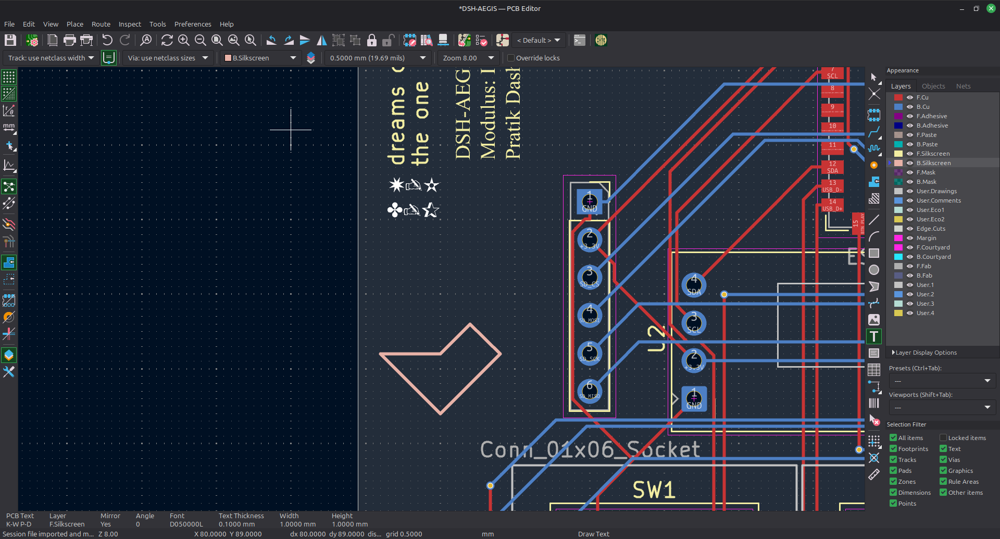

Then I opened KiCad's 3D viewer to see what it'll actually look like when it
shows up in the mail and. um. it looks like a real product?? like something you'd
BUY?? i may have made a small noise

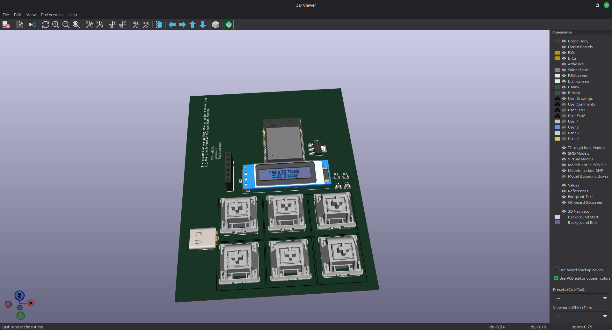

**Software used:** KiCad (PCB editor, 3D viewer)
**Lapse:** [LAPSE LINK HERE]

**Total time spent: 4h**

(genuinely like half of that was spinning the 3d model around admiring it. im
counting it. morale is a resource.)

---

# June 28th: A case, in Tinkercad, and I don't wanna hear it

Bare PCB in your pocket = short circuit waiting to happen, so it needs a case.

I used **Tinkercad**. I know. I KNOW. I can feel the Fusion 360 people making a
face at me through the screen right now. But listen: I need a box with holes in
it. Tinkercad makes a box with holes in it in fifteen minutes. Fusion 360 makes
me cry in fifteen minutes. I'll learn it eventually. probably. maybe. we'll see.

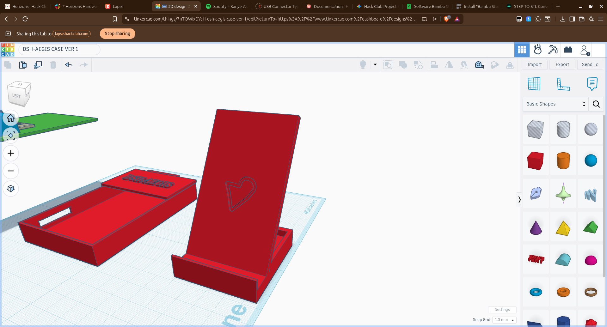

Ver 1 is:
* bottom tray the PCB drops into
* lid with a window cut out for the OLED
* 6 individual button caps
* front piece w/ the heart on it
* cutouts for USB-C on the side + the SD card slot

Then laid everything out flat on the plate to check it'd actually print, and
mostly to check the button caps weren't so small they'd fly off the bed and get
absorbed into the carpet dimension, never to be seen again.

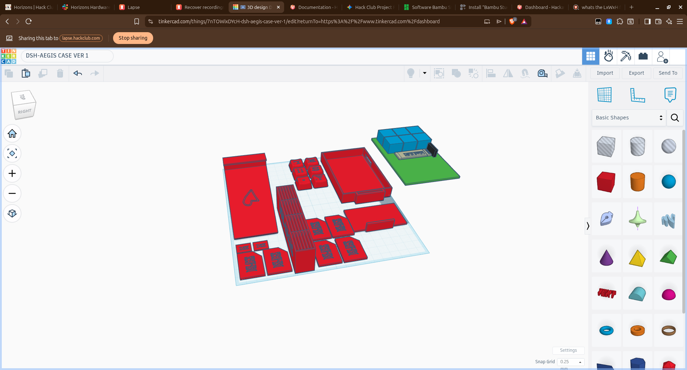

Not printing yet tho — waiting till the boards actually arrive so I can measure
real things with calipers instead of trusting numbers I made up in my head.

**Software used:** Tinkercad (3D modelling), Bambu Studio (slicing, eventually)
**Lapse:** [LAPSE LINK HERE]

**Total time spent: 5h**

---

# June 30th: Firmware, and two bugs that made me question my whole personality

Took a day off (touched grass, allegedly) and then wrote the actual code.

Flow is: PIN screen → unlock → scroll thru your saved logins → hit PLAY → it
types the password wherever your cursor is.

For the crypto I stuck to extremely boring standard stuff on purpose: **PBKDF2**
to stretch the 4-digit PIN into a real key (60,000 rounds so guessing is slow),
**AES-256** for the vault itself, and an **HMAC** so a wrong PIN fails the check
and the device never even *attempts* to decrypt. Rolling your own crypto is how
you end up as somebody's cautionary example in a blog post.

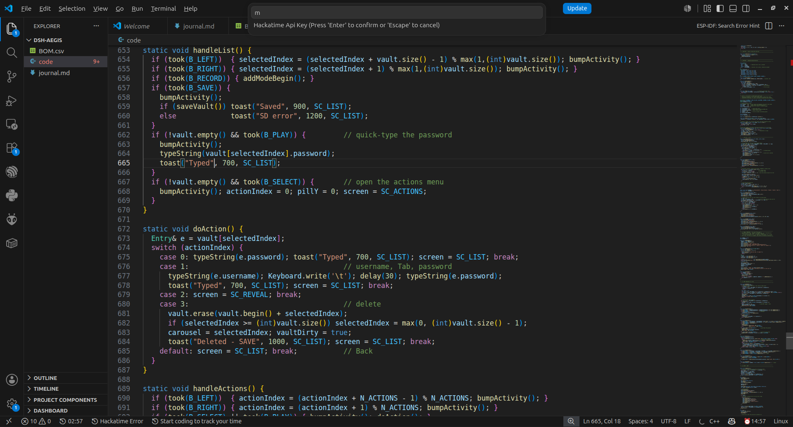

## bug 1: the SD card that refused to exist

Flashed it. Screen turns on. `No SD card`. cool. cool cool cool.

Swapped the card. Reformatted it. Tried a different card. Reflowed the solder.
Checked my pins against the schematic like six times — SD_CS = IO35, MOSI = IO36,
SCK = IO37, MISO = IO38, all correct!! Still nothing. I was about 90% sure I had
killed the board.

it was a dropdown menu. in the arduino ide.

If you tell the ESP32 you have **OPI PSRAM**, the chip grabs IO35/36/37 for the
PSRAM at boot, *before your code even runs.* Those are three of my four SD pins.
So the chip was quietly stealing my entire SPI bus and my code was just yelling
into the void.

Set **PSRAM: Disabled** → card mounted instantly, first try. I stared at a wall
for a bit. Then I put a giant comment at the top of the file so future me never
loses those 2 hours again.

## bug 2: the screen that would not stop vibrating

This one's funnier. All the smooth sliding in the UI is just numbers easing
toward a target a bit each frame — once you're close enough, snap and stop. My
"close enough" check was:

```c
if (abs(d) < 0.001f) return target;
```

`d` is a float. `abs()` in Arduino is the **integer** one. So `abs(0.4)` = `0`.
Which is less than 0.001. So it snapped when it wasn't done, drifted, snapped,
drifted, forever. My beautiful liquid iOS-ass animation looked like the screen
was having a panic attack.

fix was literally one letter:

```c
if (fabs(d) < 0.001f) return target;
```

`fabs` = the float version. instantly smooth. one (1) letter. forty (40) minutes.

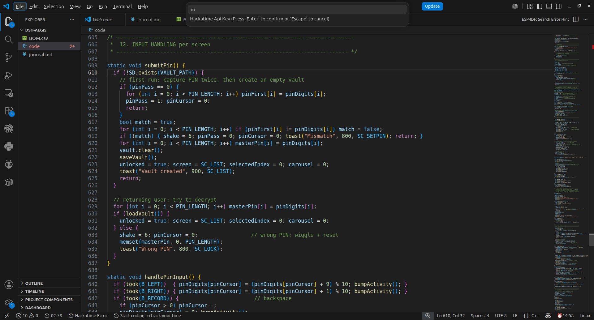

**Software used:** Arduino IDE / VS Code, U8g2 library, mbedTLS
**Lapse:** [LAPSE LINK HERE]

**Total time spent: 6h**

---

# Where it's at

Board's routed, case is modelled, firmware runs. Next is actually ordering the
PCB + printing the case, and then discovering how many things I got wrong in
physical reality that looked totally fine on a screen. Realistically: several.

Still on the todo list:
* add passwords **on the device** instead of over serial (a password manager that
  needs a computer to set up is a lil embarrassing ngl)
* PIN longer than 4 digits
* change your PIN without nuking the whole vault
* lockout after too many wrong guesses

**Grand total: 34h**

would 100% do again. already thinking abt v2 which is probably a bad sign
